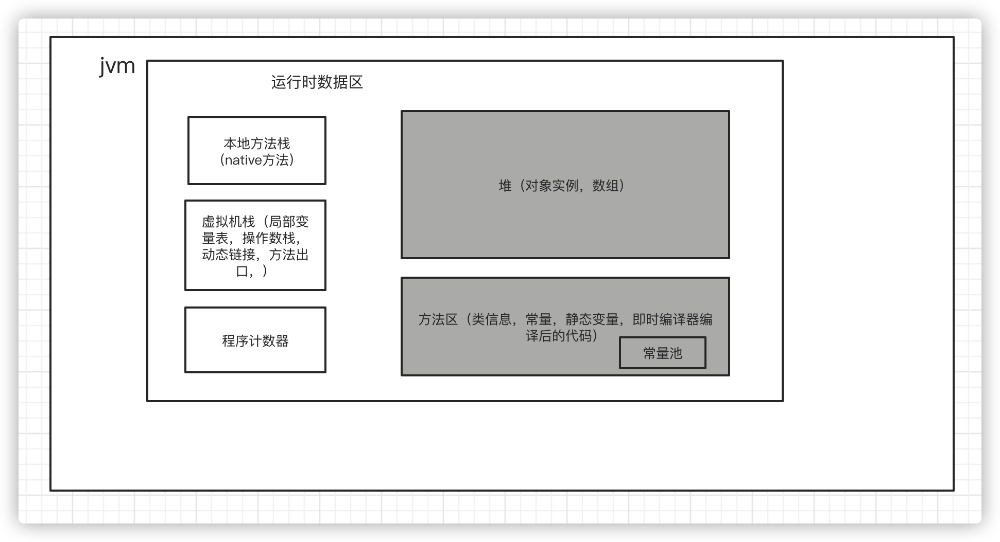
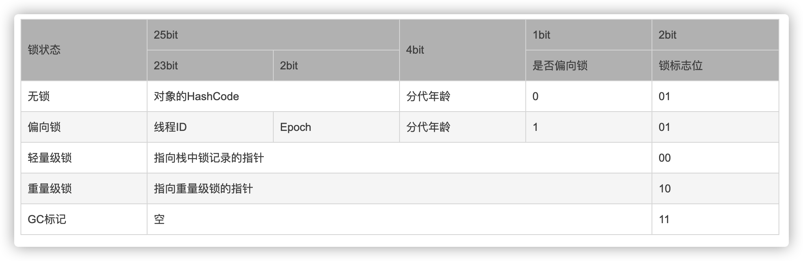

# 自动内存管理机制

## Java内存区域

#### 1.程序计数器
当前线程所执行的字节码的行号指示器

#### 2.虚拟机栈
用于存储局部变量表，操作数栈，动态链接，方法出口

#### 3.本地方法栈
服务native方法

#### 4.堆
用于存储对象实例和数组，线程共享

#### 5.方法区
存储已被虚拟机加载过的类信息，常量（常量池），静态变量，即时编译器编译的代码，线程共享

#### 6.运行时常量池
用于存放编译器生成的各种字面变量和符号引用。

#### 7.直接内存
直接内存不属于Java内存区域，在Java 1.4中加入了NIO（new Input/Output），引入了基于通道（channel）和缓冲区（buffer）的I/O方式，它可以使用native函数直接分配堆外内存，然后通过存储在Java堆里面的DirectByteBuffer对象作为这块内存的引用进行操作。这样在一些场景中能显著提高性能，因为避免了从Java堆到native堆中来回拷贝数据。

## hotspot对象创建

加载 --> 解析（检查，准备，解析） --> 初始化 --> 使用 --> 卸载

#### 1.在常量池里查找类的符号引用，并检查这个符号引用的类是否被加载，解析，初始化。

#### 2.在堆中分配内存，如果是连续空闲内存，一般使用指针碰撞,如果是不连续空闲内存，一般使用空闲列表。
内存分配并发问题解决方式：a.CAS失败重试，b.TLAS（本地线程分配缓冲），为每一个线程预先分配一块内存，jvm给线程分配内存时，首先在TLAS分配，当对象大于TLAS剩余内存或TLAS内存已经用尽时，再采用CAS分配内存。

#### 3.初始化零值

#### 4.设置对象头，

#### 5.对象init

## 对象访问定位
#### 1.通过句柄访问对象
Java栈重的reference --> （java堆）句柄池中的对象实例数据指针 --> java堆的实例池中的对象实例数据；方法区中对象类型数据）

#### 2.通过直接指针访问对象
Java栈重的reference --> （java堆）对象实例数据 --> 方法区中对象类型数据  
