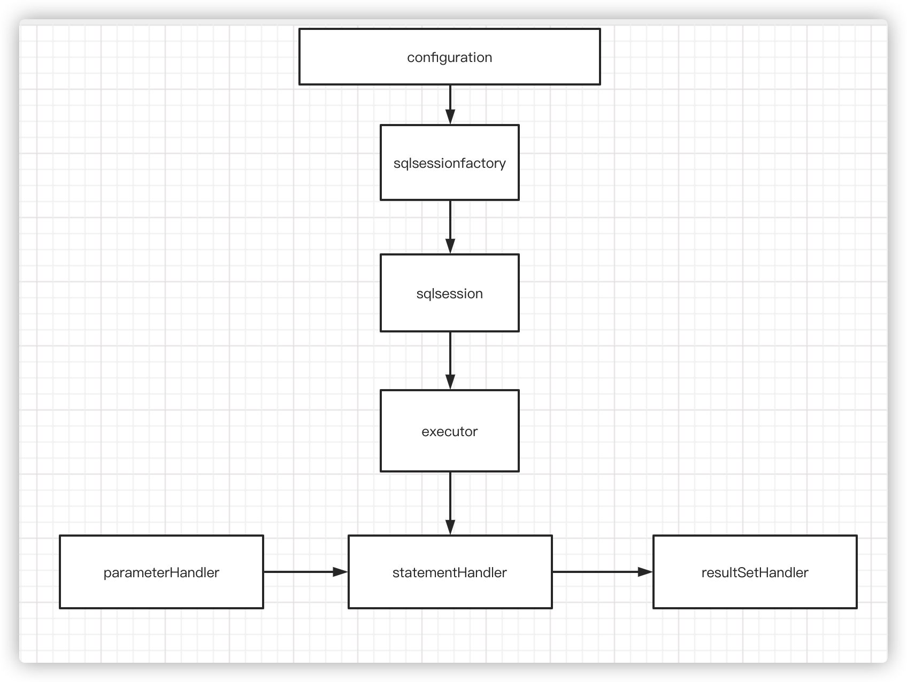
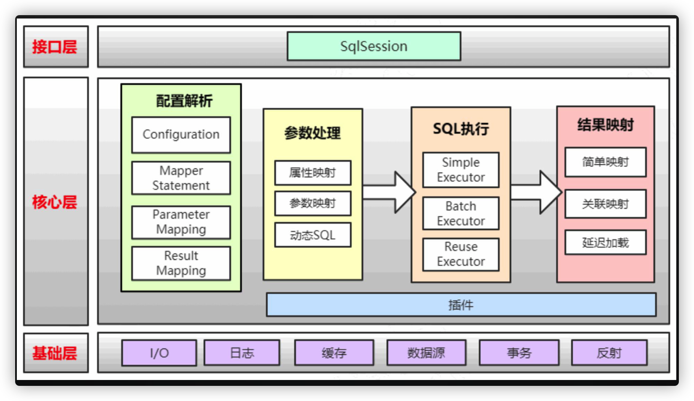

# MyBatis应用与原理

## MyBatis Java API

#### 编程式使用
- 配置MyBatis全局配置文件，environments标签（datasource type（资源管理），driver，url，username，password），Mappers标签
- 通过全局配置文件生成 sqlSessionFactory，通过sqlSessionFactory 生成 sqlSession。Mybatis对数据库的操作都是由这个sqlSession来进行的。
- 通过MyBatis mapper.xml文件中的namespace + sql语句的ID找到需要执行的sql语句。然后通过sqlSession里的方法来执行找到的sql语句

#### 核心对象与生命周期
- sqlSessionFactoryBuilder - 通过全局配置文件生成sqlSessionFactory - 只为生成sqlSessionFactory
- sqlSessionFactory - sqlSession的工厂类 - 和应用和生命周期一样
- sqlSession - 对数据库操作的类 - 每个方法里都需要创建一个sqlSession，和方法的生命周期一样
- *mapper - Mybatis为查找Sql封装的代理对象（JDK动态代理）- 和sqlSession的生命周期一样

#### 核心配置
- configuration - mybatis配置开始
- properties - 引用加载提取出来的配置文件，独立出来，方便维护
- typeAlases - 定义别名，方便使用
- typeHandler - 类型处理器，处理数据库字段名与java对象属性的映射
- objectFactory - 通过反射创建对象的实例，封装了一些对象处理的操作
- plugins - 插件，通过拦截来实现插件功能
- environments - 包括事务管理，数据源配置
- databaseIdProvider - 多数据源配置
- mappers - sql语句xml的映射器

###### xml映射器
- cache - 命名空间缓存配置（二级缓存）
- cache-ref - 引用其他命名空间缓存配置
- resultMap - 数据库结果集与对象映射关系
- sql - 可被其他语句引用的可重复使用的语句块
- insert
- update
- delete
- select

## MyBatis高级用法与扩展

#### 动态SQL
- if - test属性判断
- choose，when，otherwise - 从多个条件中选择
- trim， where, set
- foreach

#### 批量操作
- 在配置文件里设置ExecutorType为BATCH
- 使用动态sql语句，批量添加，删除，更新多条数据。

#### 关联查询与延迟加载
- 创建一个model带有一个list，使用resultMap作为结果集
- 嵌套结果集（resultMap使用assciation标签，将另外一个对象的属性放到assciation标签里面）
- 嵌套查询（resultMap，将嵌套查询的方法放到assciation标签里），会存在N+1问题
- 延迟加载，只有在用的关联的对象的时候（get）才执行查询 - 将配置文件中lazyLoadingEnabled设置为true

#### 字段变动
- 创建一个XML继承Mybatis自动生成的XML，创建一个接口继承MyBatis自动生成的接口。`<mapper namespace=“child” extends=“parent”>`
- 只能继承statement，不能继承sql，resultMap
- 在parent xml和 child xml 的 statement id相同的情况下，会使用child xml中的statement id

- 通用mapper，传入一个泛型

---

#### MyBatis主要工作流程

#### MyBatis架构分层与模块划分

#### MyBatis缓存机制
- 基本缓存 - 默认是PerpetualCache，也可以自定义，比如RedisCache，EhCache等，具备基本功能的缓存类。

- LruCache - 当缓存达到上限时候，删除最近最少使用的缓存（Least Recently Use）- eviction=“LRU”（默认）。
- FifoCache - 当缓存达到上限的时候，删除最先入队的缓存 - evuction=“FIFO”
- SoftCache/WeakCache - 通过JVM的软引用和弱引用来实现缓存，当JVM内存不足时，会自动清理掉这些缓存，基于SoftReference和WeakReference - eviction=“SOFT”/eviction=“WEAK” 

- LoggingCache -- 带日志功能的缓存，输出缓存命中率
- SynchronizedCache -- 同步缓存，基于synchronized关键字实现，解决并发问题
- BlockingCache -- 阻塞缓存，通过在get/put方法中加锁，保证只有一个线程操作缓存，基于Java重入锁实现 -- blocking=true
- SerializedCache -- 支持序列化的缓存，将对象序列化后存入缓存，取出时反序列化 -- readOnly=false（默认）
- ScheduledCache -- 定时调度的缓存，在进行get/put/remove/getSize等操作前，判断缓存时间是否超过了设置的最长缓存时间（默认是一小时），如果是，则清空缓存，每隔一段时间清空一次 -- flushInterval 不为空
- TransactionalCache -- 事务缓存，在二级缓存中使用，可一次存入多个缓存，移除多个缓存 -- 在TransactionalCacheManager中用Map维护对应关系

- 一级缓存，作用域：session， 默认开启，存放在Executor里面，更新、删除操作会清空一级缓存
- 二级缓存，作用域：namespace， 默认关闭，在namespace加入cache标签开启，CacheingExecutor装饰器里，单个方法可以使用UseCache=“false”关闭二级缓存，二级缓存跟事务绑定，commit了才会存入缓存

#### MyBatis底层原理与设计思想
