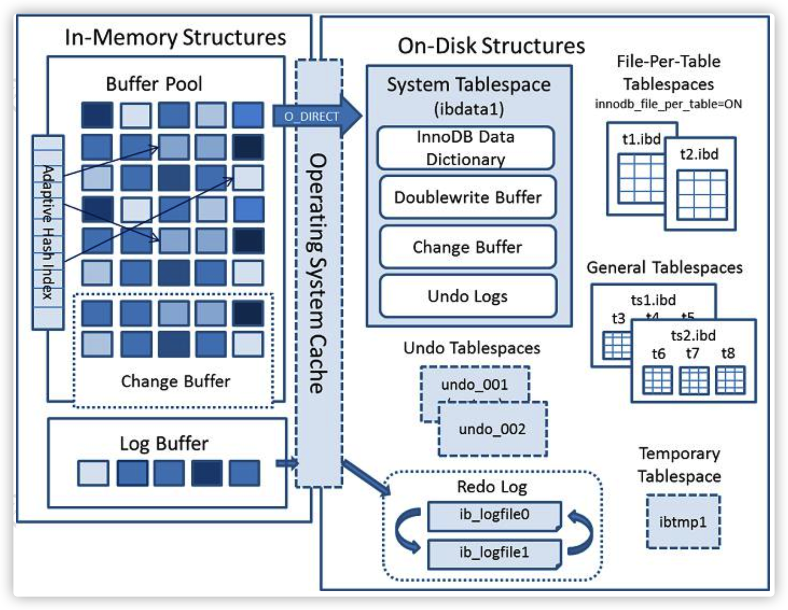

# MySQL性能优化

## MySQL架构与SQL执行流程

#### MySQL语句执行流程

**注**：mysql8移除了查询缓存功能，这里就没有再画出来了

**1.通信协议**
MySQL是支持多种通信协议的，可以使用同步/异步的方式，支持长连接/短连接
保持长链接会消耗内存，长时间不活动的连接，mysql服务器会自动断开
```sql
show global variables like 'wait_timeout'; --非交互式超时时间，如JDBC程序
show global variables like 'interactive_timeout'; --交互式超时时间，如数据库工具
```
默认是28800秒，8小时

mysql的连接数量：
在5.7版本中默认是151个，最大可以设置成16384（2^14）

mysql主要有两种通信协议：一种是Unix socket，没有指定-h参数默认采用unix socket（省略了 -S /var/lib/mysql/mysql.sock），一种是TCP/IP，加上-h参数默认是TCP/IP协议

**2.通信方式**
mysql使用的是半双工的通信方式，数据双向传输，但不能同时传输

**3.词法解析和预处理（Parser & Preprocesser）**
一条SQL语句为什么能被识别？
这就是mysql的Parser解析器和Preprocesser预处理模块。
这一步主要做的就是对语句基于sql语法，进行词法和语法的分析，语义的分析。

- 词法分析
词法分析就是把一个完整的sql语句打碎成一个个单词
比如一个简单的sql语句：
`select name from user where id=1; `
它会被打碎成8个符号，每个符号是什么类型，从哪里开始到哪里结束。

- 语法解析
语法解析会对sql做一些语法检查，比如单引号有没有闭合，然后根据mysql的语法规则，生成一个解析树

任何数据库中间件，比如mycat，sharding-JDBC（用到了Druid Parser），都必须有词法和语法分析功能，在市面上也有很多开源的词法解析工具（比如LEX，Yacc）

- 预处理器
问题：如果词法和语法都正确的sql，但是表名和字段不存在，会在哪里报错，是在数据库的执行层还是解析器。比如：
`select * from nothistable;`
解析器可以分析语法，但是它怎么知道数据库里有哪些表，表里有哪些字段？
实际上还是在解析的时候报错的，解析器里又一个预处理器，它会检查生成的解析树，解析解析器无法解决的语义。比如，它会检查表名和列名是否存在，检查名字和别名，保证没有歧义。
预处理之后会得到一个新的解析树。

- 查询优化（Query Optimizer）与查询执行计划
得到解析树后是不是就要执行sql了呢？
一条sql语句是不是只有一种执行方式呢？或者说数据库最终执行的sql是不是就是我们发送给数据库的sql呢？
答案是否定的，一条sql会有很多种执行方式，最终返回相同的结果，他们是等价的。这么多执行方式到底怎么去选择呢？根据什么判断标准去选择呢？
这就是mysql的查询优化器模块（Optimizer）
查询优化器的目标就是：根据解析树生成不同的执行计划（Execution Plan），然后选择一种最优的执行计划，mysql里面有的是基于开销（Cost）的优化器，哪种执行计划开销最小，就用哪个。
下面这个查看查询的开销：
```sql
show status like "Last_query_cost";
```
实际上对于每一种数据库来说，优化器都是必不可少的，他们通过复杂的算法实现尽可能优化查询效率的目标，但是优化器也不是万能的，并不是再垃圾的sql语句都能优化，也不是每次都能选择到最优的执行计划，所以在编写sql语句的时候还是要注意。

优化器是怎么得到执行计划？
首先要启用优化器的跟踪（默认是关闭的）
```sql
show variables like "optimizer_trace";
set optimizer_trace='enable=on';
```
注意：开启这个开关是会消耗性能的，因为它要把优化器分析的结果写到表里面，所以不要轻易开启，或者查看完之后关闭它（设为off）

- 存储引擎
得到执行计划，sql是不是就可以执行了？
问题：1.从逻辑的角度，我们的数据是放在哪里？2.执行计划在哪里执行，由谁去执行？
存放在表table里，表在存储数据的时候，还要组织数据的存储结构，这个存储结构就是我们存储引擎决定的，所以存储引擎也可以叫做表类型。

InnoDB：mysql7之后的默认存储引擎
支持事务，支持外建，数据的完整性，一致性更高
支持行级锁和表级锁。
支持读写并发，写不阻塞读（MVCC）
特殊的索引存储方式（B+ tree），减少IO，提升查询效率

- 执行引擎，返回结果
执行引擎使用执行计划去操作存储引擎，它使用存储引擎提供的API来完成操作，不同存储引擎的API相同，所以修改表的存储引擎，操作方式不需要改变。


#### MySQL的架构与内部模块

1.Connectors：用来支持各种语言和SQL的交互，比如java，python的JDBC。
2.Managerment Services & Utilities：系统管理和控制工具，包括备份恢复，mysql复制，集群等。
3.Connection Pool：连接池，管理需要缓冲的资源，包括用户密码权限线程等。
4.SQL Interface：用来接收用户的SQL命令，返回用户需要的查询结果。
5.Parser：用来解析SQL语句。
6.Optimizer：查询优化。
7.Caches & Buffers：查询缓存，除了行记录缓存外，还有表缓存，Key缓存，权限缓存等。
8.Pluggable Storage Engines：插件式存储引擎，它提供API给服务层使用，跟具体的文件系统打交道。

#### InnoDB存储引擎的磁盘与内存结构


## MySQL索引原理与使用原则
在InnoDB中，索引类型有三种，普通索引，唯一索引（主键索引是特殊的唯一索引），全文索引。
普通（Normal）：也叫非唯一索引，是最普通的索引，没有任何限制。
唯一（Unique）：唯一索引要求键不能重复。另外需要注意的是，主键索引是特殊的唯一索引，他要求键不能为空。
全文（FullText）：针对比较大的数据，如果也要解决like查询效率低的问题，可以创建全文索引。只有文本类型的字段才能创建全文索引，比如char，varchar，text。

#### 索引的本质

#### 索引底层的数据结构
InnoDB索引的底层结构是B+tree。

#### 不同存储引擎索引的实现方式
聚集索引（聚簇索引）：就是索引建的逻辑顺序跟表数据行的物理存储顺序是一致的
辅助索引存储的是辅助索引和主键，如果使用辅助索引，会根据主键在主键索引中查询，最终取得数据（比如字典的目录是按拼音排序的，内容也是按拼音排序的，按拼音排序的这种目录就叫聚集索引）。

#### 索引的创建和使用原则
1.经常用的列优先（最左匹配原则）联合索引的最左匹配原则，不能不用第一个字段，不能中断。
2.离散度高的列优先（离散度高原则）索引尽量建立在离散度高的字段上（重复率低）
3.宽度小的列优先（最少空间原则） 

回表：非主键索引，通过索引先找到主键索引的建，再通过主键索引查处索引里没有的数据，它比基于主键索引的查询多扫描了一颗索引树，这个过程就叫做回表。
覆盖索引：在辅助索引里，不管是单列索引还是联合索引，如果select的数据列只用从索引中就能获取，不必从数据区中读取，这时候使用的索引就是覆盖索引。

索引条件下推（ICP）
> 注意：索引的比较是在存储引擎上进行的，数据记录的比较，是在Server层进行的。

开启ICP
```
set optimier_switch='index_condition_pushdown=on';
```

索引的创建
1.在用于where判断，order排序和join的（on）字段上创建索引。
2.索引不要过多 ----> 浪费空间，更新变慢。
3.区分度低的字段，例如性别，不要建索引 ----> 离散度太低，导致扫描行数过多
4.频繁更新的值，不要作为主键或者索引 ----> 页分裂
5.组合索引把散列性高（区分度高）的值放在前面。
6.创建复合索引，而不是修改单列索引。

用不到索引的情况
1.索引列上使用函数（replace/substr/concat/sum/avg/count），表达式，计算（+ - * /）。
2.字符串不加引号，出现隐式转换。
3.like条件中前面带% ----> 过滤的开销太大，所以无法使用索引。这个时候可以用全文索引。
4.负向查询，not like不能，!=(<>),not in在某些情况可以

> 用不用索引，最终都是优化器说了算.

## MySQL事务与锁

#### 事务的特性与事务的并发造成的问题

#### 事务读一致性问题解决方案

#### MVCC的原理

#### 锁的分类，行锁的原理，行锁的算法


## MySQL性能优化总结

#### MySQL数据库优化的层次和思路

#### MySQL数据库优化工具


