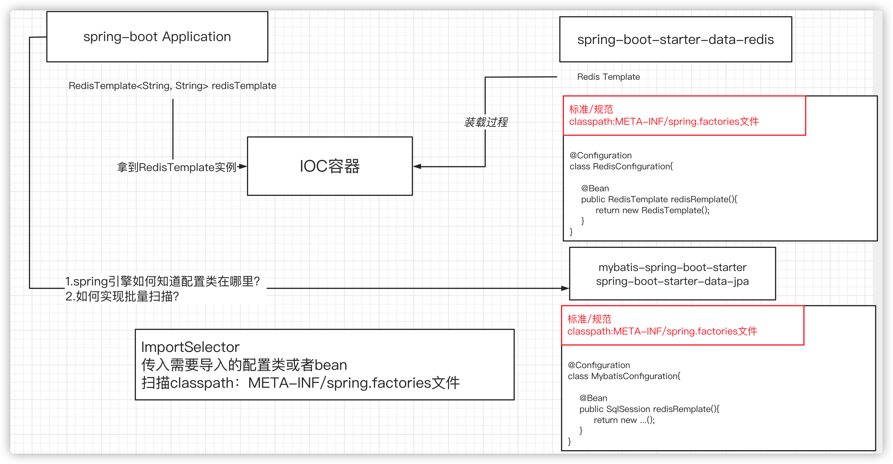

# springboot核心特性和设计思想

## springboot自动装配


### 约定优于配置
1.maven的目录结构（默认会以jar包的方式打包，默认会有resource资源文件夹
2.提供开箱即用的组件，如spring-boot-starter-web，内置tomcat，resource（template/static）
3.默认的配置文件，application.properties

### springboot对已有技术的封装
1.AutoConfiguration 自动装配
2.starter 启动依赖，依赖于自动装配的技术
3.actuator 监控，提供一些endpoint，http、jmx形式去进行访问，health信息，metrics信息。。。
4.Springboot CLI 命令行操作功能，groovy脚本，

### SpringBootApplication

#### EnableAutoConfiguration
1.@AutoConfigrationPackage
2.@Import(AutoConfigurationImportSelector.class)

- AutoCOnfigurationImportSelector
- AutoConfigurationPackages.registrar

> 能不能根据上下文来激活不同的bean

###### 动态注入（条件筛选，在注入之前处理）
- ImportSelector：DeferredImportSelector
- Registrar：ImportBeanDefinitionRegistrar


#### Import
xml:`<import resource=""/>`
加载其他的配置文件

#### ComponentScan
扫描带有@Component注解的类

#### Configuration

## SPI扩展点（service provider interface）

满足以下条件：
1.满足目录结构一致
2.文件名一致
3.key要存在，并且符合当前的加载

## Starter组件原理

#### 条件判断，加载类之前必须要加载相应的类
- @ConditionOnBean注解
springboot官方包，没有spring.factories文件，所以官方组件都是在spring-boot-starter-autoconfigure里面的，然后通过条件触发是否加载

- 在classpath：/MATA-INF目录下创建spring-autoconfigure-metadata.properties文件

#### 自定义starter
1.format（格式化，string/json）


## Actuator（监控）
```
<dependency>
    <groupId>org.springframework.boot</groupId>
    <artifactId>spring-boot-starter-actuator</artifactId>
</dependency>
```
#### health 健康检测

#### metrics
- jvm（垃圾收集器/内存/堆）
- 系统（运行时间、平均负载、处理器信息）
- 线程池信息
- tomcat会话信息

#### loggers

Actuator可以配合prometheus/grafana使用可以使监控信息可视化（如大盘展示）

