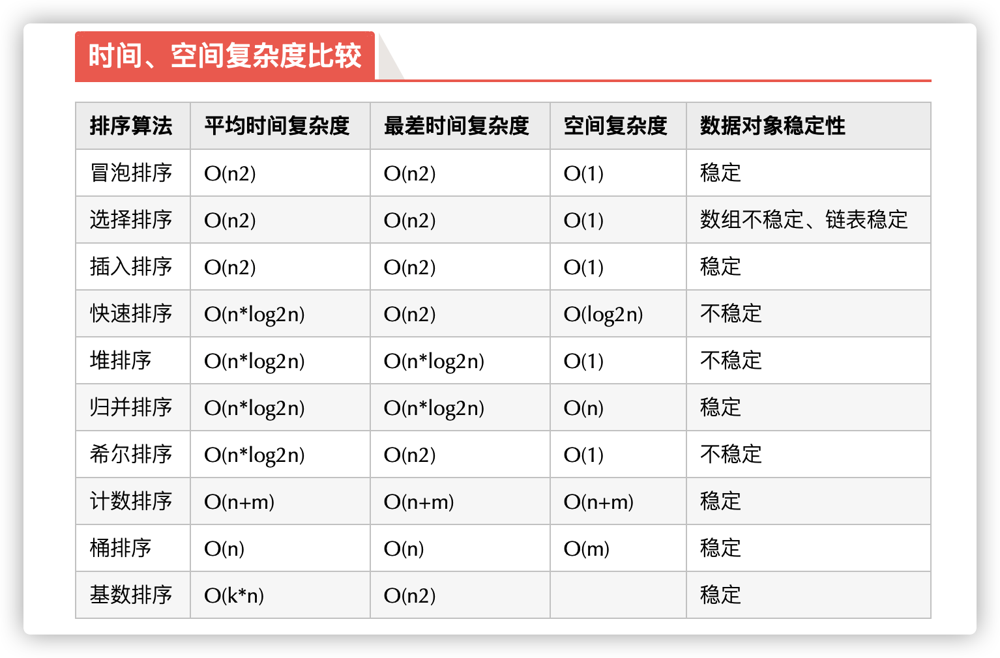

# 十大经典排序算法


## 冒泡算法
1.比较相邻的元素，如果第一个比第二大，就交换他们两个。
2.对每一组相邻的元素作同样的工作，从开始第一对到结尾的最后一对，做完这一步，结尾的元素就是最大的数。
3.针对所有的元素重复以上步骤，除了最后一个。
4.持续每次对越来越少的元素重复以上步骤，直到没有任何一对数字需要比较。

**代码：**
```java
    public void bubbleSort(int a[], int n){
        boolean isSwap;
        for (int i = 0; i < n-1; i++) {
            isSwap = false;
            for (int j = 0; j < n-i-1; j++) {
                if (a[j] > a[j+1]){
                    int temp = a[j];
                    a[j] = a[j+1];
                    a[j+1] = temp;
                    isSwap = true;
                }
            }
            if (!isSwap){ //添加判断，使最优时间复杂度为O(n)
                return;
            }
        }
    }
``` 

## 选择排序
1.在未排序序列中找到最小（大）元素，存放到排序序列起始位置。
2.从剩余未排序元素中继续找最小（大）元素，然后放到已排序序列末尾。
3.以此类推，直到所有元素都排序完毕。

**代码：**
```java
    public void selectionSort(int[] a){
        int temp;
        int minIndex;
        for (int i = 0; i < a.length-1; i++) {
            minIndex = i;
            for (int j= i+1; j < a.length; j++) {
                if (a[j] < a[minIndex]){
                    minIndex = j;
                }
            }
            temp = a[minIndex];
            a[minIndex] = a[i];
            a[i] = temp;
        }
    }
```

## 插入排序
1.从第一个元素开始，该元素可以认为已经被排序。
2.取出下一个元素，在已经排序的元素序列中从后往前扫描。
3.如果该元素（已排序）大于新元素，将该元素移到下一位置。
4.重复步骤3，直到找到已排序元素小于或等于新元素的位置。
5.将新元素插到该位置后。
6.重复步骤2-5.

**代码：**
```java
    public void insertSort(int a[]){
        for (int i = 1; i < a.length; i++) {
            if (a[i]<a[i-1]){
                int j = i-1;
                int temp = a[i];
                a[i] = a[i-1];
                boolean flag = false;
                while(temp < a[j]){
                    if (j == 0){
                        a[0] = temp;
                        flag = true;
                        break;
                    }
                    a[j+1] = a[j];
                    j--;
                }
                if(!flag){
                    a[j+1] = temp;
                    flag = false;
                }
            }
        }
    }
```

## 快速排序
1.选取第一个数为基准。
2.将比基准小的数交换到前面，比基准大的数交换到后面。
3.将左右分区重复第二步，直到每个分区只有一个数。
**代码：**
```java
public void quickSort(int a[], int first, int last){
        if(first < last){
            int i = first;
            int j = last;
            int temp = a[first];
            while(i < j){
                while (i < j && a[j] >= temp){
                    j--;
                }
                if (i < j){
                    a[i++] = a[j];
                }
                while (i < j && a[i] < temp){
                    i++;
                }
                if (i < j){
                    a[j--] = a[i];
                }
            }
            a[i] = temp;
            quickSort(a, first, i-1);
            quickSort(a, i+1, last);
        }
    }
```

## 堆排序
堆排序（Heapsort）是指利用堆这种数据结构所设计的一种排序算法。堆积是一个近似完全二叉树的结构，并同时满足堆积的性质：即子节点的键值或索引总是小于（或者大于）它的父节点。

1.将初始待排序关键字序列（R1，R2，，，Rn）构建成大顶堆，此堆为初始的无序区。
2.将堆顶R[1]与最后一个元素R[n]交换，此时得到新的无序区（R1，R2，，，Rn-1）和新的有序区Rn，且满足R[1,2,,,n-1]<=R[n].
3.由于交换后新的堆顶R[1]可能违反堆的性质，因此需要对当前无序区(R1,R2,……Rn-1)调整为新堆，然后再次将R[1]与无序区最后一个元素交换，得到新的无序区(R1,R2….Rn-2)和新的有序区(Rn-1,Rn)。不断重复此过程直到有序区的元素个数为n-1，则整个排序过程完成。
```java

```

