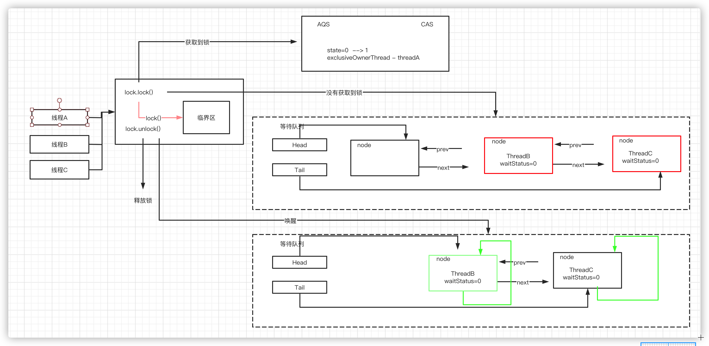

# 深入理解ReentrantLock

## Lock接口中的方法
- lock()
- unLock()
- tryLock() //不阻塞线程的情况下判断是否能去抢占锁
- tryLock(long time) //带超时时间的判断是否能去抢占锁

## 锁的设计
- 锁的互斥性 -- 共享资源 -- 标记（0 无锁， 1 有锁）
- 没有抢占到锁的线程 -- 释放CPU资源（等待，唤醒）
- 等待的线程怎么存储 -- 数据结构去存储一些等待中的线程， FIFO（等待队列）
- 公平和非公平（是否允许插队）
- 重入特性（识别是否是同一个线程，ThreadId）

## ReentrantLock

#### locK
第一个线程进来通过CAS操作，抢占锁，如果抢到了就保存当前线程
```java
final void lock() {
    if (compareAndSetState(0, 1))  //抢占互斥资源， CAS操作（乐观锁），保证线程安全
        setExclusiveOwnerThread(Thread.currentThread()); //保存当前线程
    else
        acquire(1);
}
```
第二个线程进来没有抢占到锁
```java
public final void acquire(int arg) {
    if (!tryAcquire(arg) &&
        acquireQueued(addWaiter(Node.EXCLUSIVE), arg))
        selfInterrupt();
}
```
这里面有三个方法
- tryAcquire(arg)
- acquireQueued(addWaiter(Node.EXCLUSIVE), arg)
- selfInterrupt()

继续抢占锁`tryAcquire(arg)`，如果抢占成功，返回true，acpuire方法直接结束
```java
final boolean nonfairTryAcquire(int acquires) {
    //获取当前的线程
    final Thread current = Thread.currentThread();
    int c = getState();
    if (c == 0) {                                     //判断无锁
        if (compareAndSetState(0, acquires)) {        //CAS
            setExclusiveOwnerThread(current);
            return true;
        }
    }
    else if (current == getExclusiveOwnerThread()) {  //判断重入
        int nextc = c + acquires;
        if (nextc < 0) // overflow
            throw new Error("Maximum lock count exceeded");
        setState(nextc); // state+1
        return true;
    }
    return false;
}
```
如果没有抢占到锁，将当前线程添加到等待队列中
```java
private Node addWaiter(Node mode) {
    Node node = new Node(Thread.currentThread(), mode);
    // Try the fast path of enq; backup to full enq on failure
    Node pred = tail;
    if (pred != null) {
        node.prev = pred;
        if (compareAndSetTail(pred, node)) {
            pred.next = node;
            return node;
        }
    }
    enq(node);    //添加到队列，循环尾插法
    return node;
}
```
阻塞没有获取锁的线程
循环先判断头节点是否能抢占锁，抢到就返回，没抢到就根据状态判断是取消移除还是阻塞
```java
final boolean acquireQueued(final Node node, int arg) {
    boolean failed = true;
    try {
        boolean interrupted = false;
        for (;;) {
            final Node p = node.predecessor();
            if (p == head && tryAcquire(arg)) {
                setHead(node);
                p.next = null; // help GC
                failed = false;
                return interrupted;
            }
            if (shouldParkAfterFailedAcquire(p, node) &&  //根据状态判断取消移除还是阻塞
                parkAndCheckInterrupt())   //阻塞，中断传递，为了响应中断
                interrupted = true;
        }
    } finally {
        if (failed)
            cancelAcquire(node);
    }
}
```

