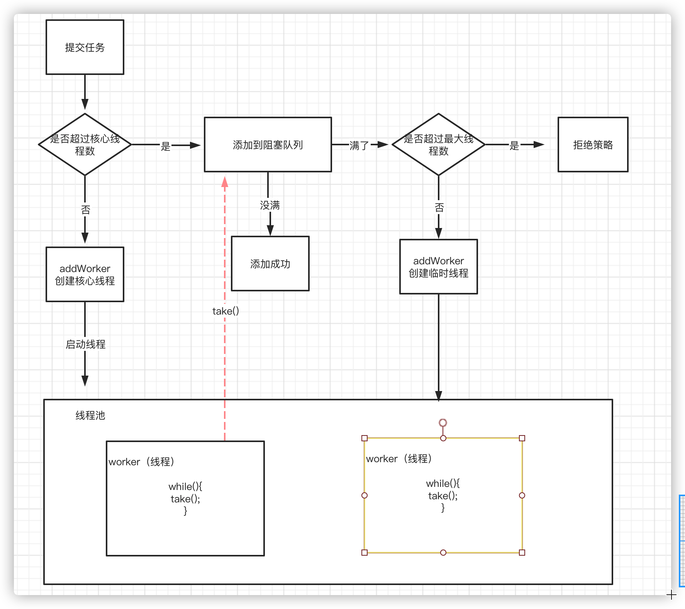

# 线程池的设计与原理
java中线程池的实现：ThreadPoolExExecuExecutor类
```java
public ThreadPoolExecutor(int corePoolSize,
                          int maximumPoolSize,
                          long keepAliveTime,
                          TimeUnit unit,
                          BlockingQueue<Runnable> workQueue,
                          ThreadFactory threadFactory,
                          RejectedExecutionHandler handler) {
```
创建线程池需要的参数：
1.核心线程数
2.最大线程数
3.等待队列
4.拒绝策略
5.线程存活时间
6.时间单位

## 线程池执行的两大方法
executor() //不带返回值
submit()   //带返回值，Future/Callable

#### executor内部实现
```java
public void execute(Runnable command) {
        if (command == null)
            throw new NullPointerException();
        
        int c = ctl.get();
        if (workerCountOf(c) < corePoolSize) {
            if (addWorker(command, true))
                return;
            c = ctl.get();
        }
        if (isRunning(c) && workQueue.offer(command)) {
            int recheck = ctl.get();
            if (! isRunning(recheck) && remove(command))
                reject(command);
            else if (workerCountOf(recheck) == 0)
                addWorker(null, false);
        }
        else if (!addWorker(command, false))
            reject(command);
    }
```
主要有三大部分；

1.第一个if，线程池在构建的时候没有初始化核心线程，根据添加的任务来启动核心线程
int-32位
高3位来表达线程的状态，低29位表达线程数量
```java
private final AtomicInteger ctl = new AtomicInteger(ctlOf(RUNNING, 0));
    private static final int COUNT_BITS = Integer.SIZE - 3;
    private static final int CAPACITY   = (1 << COUNT_BITS) - 1;

    // runState is stored in the high-order bits
    private static final int RUNNING    = -1 << COUNT_BITS;
    private static final int SHUTDOWN   =  0 << COUNT_BITS;
    private static final int STOP       =  1 << COUNT_BITS;
    private static final int TIDYING    =  2 << COUNT_BITS;
    private static final int TERMINATED =  3 << COUNT_BITS;

    // Packing and unpacking ctl
    private static int runStateOf(int c)     { return c & ~CAPACITY; }
    private static int workerCountOf(int c)  { return c & CAPACITY; }
    private static int ctlOf(int rs, int wc) { return rs | wc; }
```
将原子变量与上一个变量，返回低位的值，然后与核心线程数比较，小于核心线程数就创建核心线程。

## 创建核心线程(addWorker)
   - 统计当前的工作线程 --> 考虑线程安全性（compareAndIncrementWorkerCount(c)）
   - 创建线程之前，判断是否超过设定的阈值
   - 创建一个线程，并且启动
   - 存储的容器（线程池）（workers -> `HashSet<Worker>()`）
```java
private boolean addWorker(Runnable firstTask, boolean core) {
        retry:
        for (;;) {
            int c = ctl.get();
            int rs = runStateOf(c);

            // Check if queue empty only if necessary.
            if (rs >= SHUTDOWN &&
                ! (rs == SHUTDOWN &&
                   firstTask == null &&
                   ! workQueue.isEmpty()))
                return false;

            for (;;) {
                int wc = workerCountOf(c);
                if (wc >= CAPACITY ||
                    wc >= (core ? corePoolSize : maximumPoolSize))
                    return false;
                if (compareAndIncrementWorkerCount(c))  //添加线程数量
                    break retry;
                c = ctl.get();  // Re-read ctl
                if (runStateOf(c) != rs)
                    continue retry;
                // else CAS failed due to workerCount change; retry inner loop
            }
        }

        boolean workerStarted = false;
        boolean workerAdded = false;
        Worker w = null;
        try {
            w = new Worker(firstTask);
            final Thread t = w.thread;
            if (t != null) {
                final ReentrantLock mainLock = this.mainLock;
                mainLock.lock();
                try {
                    // Recheck while holding lock.
                    // Back out on ThreadFactory failure or if
                    // shut down before lock acquired.
                    int rs = runStateOf(ctl.get());

                    if (rs < SHUTDOWN ||
                        (rs == SHUTDOWN && firstTask == null)) {
                        if (t.isAlive()) // precheck that t is startable
                            throw new IllegalThreadStateException();
                        workers.add(w);
                        int s = workers.size();
                        if (s > largestPoolSize)
                            largestPoolSize = s;
                        workerAdded = true;
                    }
                } finally {
                    mainLock.unlock();
                }
                if (workerAdded) {
                    t.start();
                    workerStarted = true;
                }
            }
        } finally {
            if (! workerStarted)
                addWorkerFailed(w);
        }
        return workerStarted;
    }
```


2.第二个if，通过offer将task加入到阻塞队列中
```java
workQueue.offer(command)
```

3.加入队列失败，并且创建**临时线程**也失败就执行拒绝策略
```java
else if (!addWorker(command, false))  //1.队列满了，2.工作线程也超过了最大值
    reject(command);
```


## 线程运行过程
- 取任务
`getTask()`从队列中取任务，如果拿不到就阻塞
- 执行任务
```java
final void runWorker(Worker w) {
        Thread wt = Thread.currentThread();
        Runnable task = w.firstTask;
        w.firstTask = null;
        w.unlock(); // allow interrupts    //关闭锁，为了关闭线程时能抢占到锁
        boolean completedAbruptly = true;
        try {
            while (task != null || (task = getTask()) != null) {
                w.lock();                 //抢占到锁，调用关闭线程方法时，必须等到线程执行结束，才能关闭
                // If pool is stopping, ensure thread is interrupted;
                // if not, ensure thread is not interrupted.  This
                // requires a recheck in second case to deal with
                // shutdownNow race while clearing interrupt
                if ((runStateAtLeast(ctl.get(), STOP) ||
                     (Thread.interrupted() &&
                      runStateAtLeast(ctl.get(), STOP))) &&
                    !wt.isInterrupted())
                    wt.interrupt();
                try {
                    beforeExecute(wt, task);
                    Throwable thrown = null;
                    try {
                        task.run();                 //执行任务
                    } catch (RuntimeException x) {
                        thrown = x; throw x;
                    } catch (Error x) {
                        thrown = x; throw x;
                    } catch (Throwable x) {
                        thrown = x; throw new Error(x);
                    } finally {
                        afterExecute(task, thrown);
                    }
                } finally {
                    task = null;
                    w.completedTasks++;
                    w.unlock();
                }
            }
            completedAbruptly = false;
        } finally {
            processWorkerExit(w, completedAbruptly);
        }
    }
```

## 线程回收
- 不需要区分核心线程还是临时线程，只要保证线程数量
- run方法执行结束，线程就回收了（while循环返回为false，`getTask()`返回为null）
```java
// Check if queue empty only if necessary.
if (rs >= SHUTDOWN && (rs >= STOP || workQueue.isEmpty())) {
    decrementWorkerCount();
    return null;
}
```

```java
// Are workers subject to culling?
boolean timed = allowCoreThreadTimeOut || wc > corePoolSize; //是否允许核心线程超时，并且线程数量大于核心线程数

if ((wc > maximumPoolSize || (timed && timedOut))
    && (wc > 1 || workQueue.isEmpty())) {
    if (compareAndDecrementWorkerCount(c))  //线程数减一
        return null;
    continue;
}
```
```java
Runnable r = timed ?   //判断超时
    workQueue.poll(keepAliveTime, TimeUnit.NANOSECONDS) :
    workQueue.take();
```


## 线程池大小
- CPU密集型 -- 保持和CPU核心数一致
- IO密集型 -- 可以多设置一些，CPU核心数 * 2

计算公式
（线程池设定的线程等待时间+线程CPU时间/线程CPU时间）+ CPU核心数

---

- 线程的使用
    - Runnable
    - Thread
    - Callable
线程的本质
线程中断

- 线程安全
原子性，可见行，有序性
volatile， synchronized 升级，MESI， Store Buffer ，指令排序， 内存屏障
ThreadLocal / Atomic / Lock(RentrantLock) / AbstractQueueSybchronizor
heppens-before 可见性模型
CAS

- 线程工具
CountDownLatch
Semaphore
ConcurrentHashMap
ThreadPoolExecutor
BlockQueue
